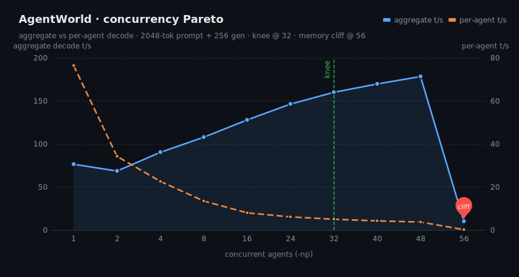
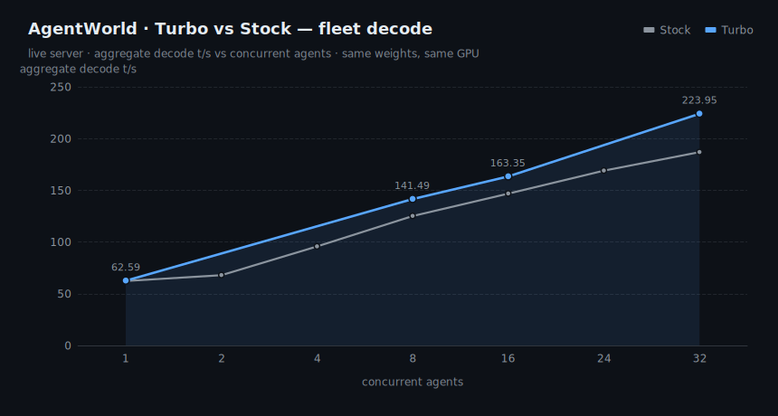
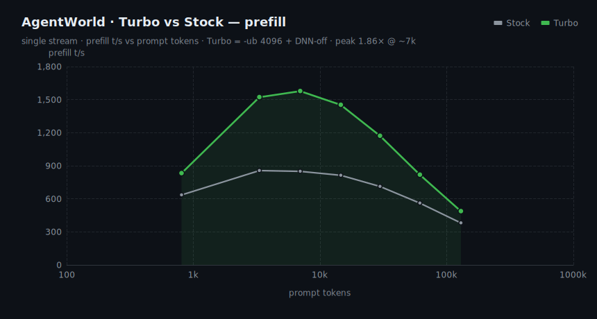
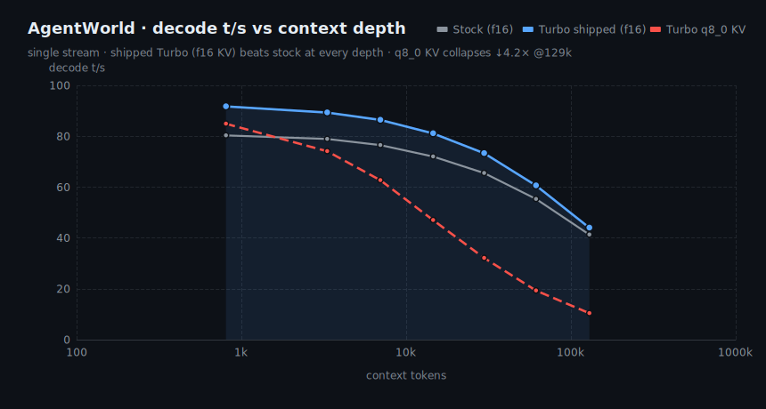
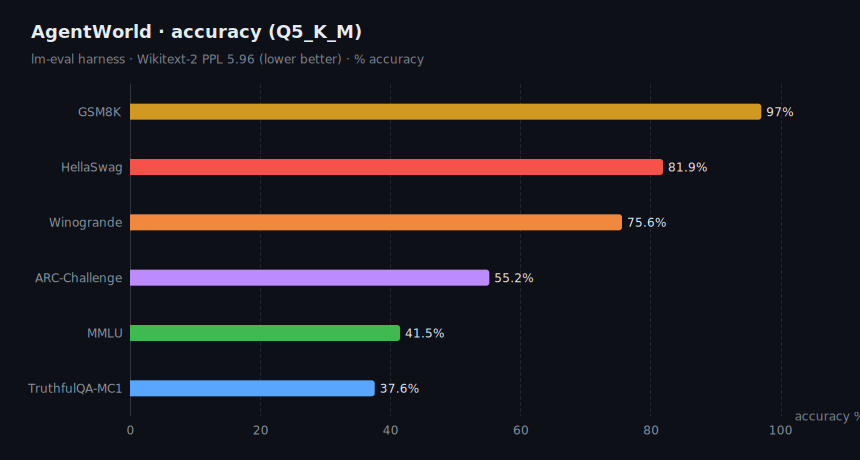
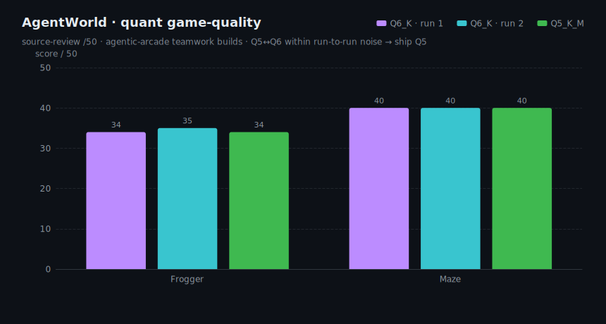

# AgentWorld-35B-A3B · B70 Turbo &nbsp;·&nbsp; R&D

> **⚗️ R&D snapshot — not a final release.** Benchmarks are measured and reproducible; the
> polished model card, weight upload, and final accuracy re-run are still pending. Numbers here
> are honest but subject to change. Cover art / banner: TODO (drop-in above this line).

B70-tuned serving package for **Qwen-AgentWorld-35B-A3B** (`qwen3_5_moe`, 34.7B total / ~3B active),
quantized **Q5_K_M**, running on a single **Intel Arc Pro B70** (30.3 GiB, 230 W) via llama.cpp SYCL.
Same weights as upstream — the "Turbo" is the serving stack (fused decode build + tuned batch/KV/DNN
flags), so every speedup is **lossless**.

## TL;DR

| axis | result |
|---|---|
| **Prefill vs stock** | **1.3–1.86×** (peak ~1.86× @ ~7k tok) — `-ub 4096` + DNN-off |
| **Decode vs stock** | **1.07–1.14×** at every depth (0.8k→129k), no penalty |
| **Fleet decode** | **~1.2× @ 32 agents**; 160→224 t/s aggregate at the knee |
| **Concurrency knee** | **np 32** (159.9 t/s agg); hard cliff at np ≥ 56 |
| **Context** | 262144 with f16 KV on the 32 GB card |
| **Quality** | lossless decode · Q5 == Q6 on game builds · GSM8K 97 / HellaSwag 81.9 |

## Ship config

```bash
# Agent fleet (default) — knee at np 32
GGML_SYCL_DISABLE_DNN=1 ONEAPI_DEVICE_SELECTOR=level_zero:gpu \
llama-server -m agentworld-35b-a3b-Q5_K_M.gguf --alias agentworld-35b-a3b-turbo \
  -ngl 99 -fa on -ctk f16 -ctv f16 -c 131072 -np 32 -b 8192 -ub 4096 \
  --host 0.0.0.0 --port 8091 --jinja
```

| mode | flags | throughput |
|---|---|---|
| Agent fleet (default) | `-np 32` | 150–224 t/s aggregate |
| Single deep agent | `-np 1 -c 262144` | 84→16 t/s (shallow→73k) |
| **Never** | `-np ≥ 56` | 21× memory cliff — do not serve |

> **KV note:** ship **f16** KV. The batched-bench charts below were captured with the bench driver's
> `q8_0` KV; on this SYCL backend q8_0 flash-attention decodes up to **4.2× slower at 129k** (chart 4).
> f16 reads marginally higher shallow and far higher deep, and Q5_K_M fits f16 KV at full 262144 ctx.

---

## Benchmarks

### 1 · Concurrency Pareto — how many agents to serve
`llama-batched-bench`, 2048-tok prompt + 256 gen. Aggregate throughput climbs to a **knee at np 32**;
np 56 falls off the 30 GiB memory cliff (−21×).



| agents | 1 | 8 | 16 | 24 | **32** | 40 | 48 | 56 |
|---|--:|--:|--:|--:|--:|--:|--:|--:|
| aggregate t/s | 76.4 | 107.8 | 127.8 | 146.3 | **159.9** | 169.6 | 178.3 | 10.0 ⚠ |
| per-agent t/s | 76.4 | 13.5 | 8.0 | 6.1 | **5.0** | 4.2 | 3.7 | 0.18 |

### 2 · Turbo vs Stock — fleet decode
Same weights / GPU / compiler, only the serving stack differs. Turbo's win grows with batch size,
peaking **1.20× at 32 agents**.



| agents | 1 | 8 | 16 | 32 | structured×32 | novel×32 |
|---|--:|--:|--:|--:|--:|--:|
| stock | 62.3 | 125.1 | 146.8 | 186.9 | 134.4 | 110.9 |
| **turbo** | 62.6 | 141.5 | 163.4 | **224.0** | 169.4 | 138.4 |
| ratio | 1.00× | 1.13× | 1.11× | **1.20×** | 1.26× | 1.25× |

### 3 · Turbo vs Stock — prefill
The `-ub 4096` + DNN-off win. KV-dtype-insensitive.



| prompt tok | 805 | 3.3k | 7k | 14.5k | 29.7k | 61k | 129k |
|---|--:|--:|--:|--:|--:|--:|--:|
| stock | 635 | 856 | 849 | 813 | 712 | 561 | 381 |
| **turbo** | 832 | 1522 | 1577 | 1452 | 1171 | 818 | 487 |
| ratio | 1.31× | 1.78× | **1.86×** | 1.79× | 1.64× | 1.46× | 1.28× |

### 4 · Decode vs context depth — and the q8_0-KV cliff
Shipped Turbo (f16) beats stock at every depth. The bench driver's **q8_0 KV collapses** with context
(the reason we ship f16).



| context tok | 805 | 3.3k | 7k | 14.5k | 29.7k | 61k | 129k |
|---|--:|--:|--:|--:|--:|--:|--:|
| stock (f16) | 80.3 | 78.9 | 76.5 | 72.0 | 65.5 | 55.3 | 41.3 |
| **turbo (f16, shipped)** | 91.7 | 89.3 | 86.4 | 81.1 | 73.3 | 60.6 | 44.0 |
| turbo (q8_0 KV) | 84.9 | 74.1 | 62.7 | 47.0 | 32.1 | 19.3 | 10.4 |

### 5 · Accuracy (Q5_K_M, lm-eval)
Lossless quant + serving → accuracy unchanged. Wikitext-2 **PPL 5.96** (lower better).



| GSM8K | HellaSwag | Winogrande | ARC-Challenge | MMLU | TruthfulQA-MC1 |
|--:|--:|--:|--:|--:|--:|
| 97.0 | 81.9 | 75.6 | 55.2 | 41.5 | 37.6 |

_GSM8K here is the CoT lm-eval config; an earlier strict-extract harness scored 58.5 — re-run pending._

### 6 · Quant game-quality — Q5 vs Q6
`agentic-arcade` teamwork builds, Claude source-review /50. **Q5 == Q6** within run-to-run noise → ship Q5
(4 GB smaller, fits f16 KV at 262144).



| build | Frogger /50 | Maze /50 |
|---|--:|--:|
| Q6_K · run 1 | 34 | 40 |
| Q6_K · run 2 | 35 | 40 |
| **Q5_K_M** | 34 | 40 |

---

## Reproduce

```bash
# charts (uses the newjordan/echarts fork via SSR → SVG)
ECHARTS_ESM=/path/to/newjordan-echarts/dist/echarts.esm.min.mjs node charts/gen_charts.mjs
```

Raw data in [`data/`](data/). Serving/bench harnesses live in `qworld_turbo/` (moe-ready build,
`bench/run_live_evals.sh`, `bench/concurrency_pareto_guarded.sh`).

## Provenance / caveats
- Weights: `qwen3_5_moe` AgentWorld-35B-A3B, Q5_K_M (imatrix). Not in this repo (R&D).
- Charts rendered dark to sit in GitHub's palette; source SVGs are static (no scripts).
- Throughput is architecture-determined — the `qwen3_5_moe` family (Ornith/NEX2/SIQ) traces the same
  curve; these models differ only in quality, not raw t/s.
