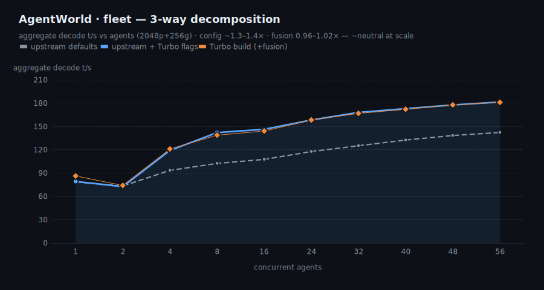
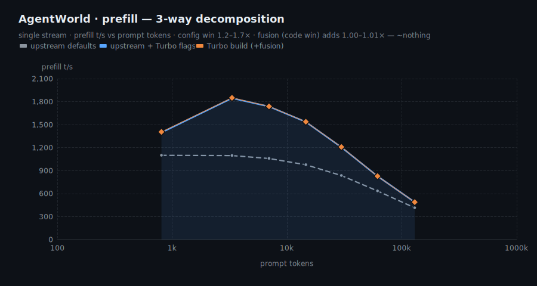
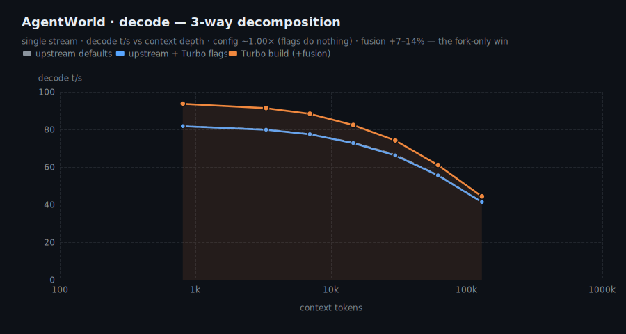

# AgentWorld-35B-A3B · B70 Turbo &nbsp;·&nbsp; R&D

> **Preview release.** All benchmarks are measured and reproducible; the final accuracy re-run is
> still pending. Weights are live at
> [Frosty40/Qwen-AgentWorld-35B-A3B-B70-Turbo-GGUF](https://huggingface.co/Frosty40/Qwen-AgentWorld-35B-A3B-B70-Turbo-GGUF).

B70-tuned serving package for **Qwen-AgentWorld-35B-A3B** (`qwen3_5_moe`, 34.7B total / ~3B active),
quantized **Q5_K_M**, running on a single **Intel Arc Pro B70** (30.3 GiB, 230 W) via llama.cpp SYCL.
Same weights as upstream — the "Turbo" is the serving stack (fused decode build + tuned batch/KV/DNN
flags), so every speedup is **lossless**.

## Where the speed comes from

Three configs, same Q5_K_M weights, same f16 KV, same GPU. `flags win = (2)/(1)` · `build win = (3)/(2)`:
1. **upstream** — mainline llama.cpp, default flags
2. **up+flags** — same mainline + Turbo flags (`GGML_SYCL_DISABLE_DNN=1 -b 8192 -ub 4096`)
3. **Turbo** — this build: same mainline + 3 fused-kernel commits (topk-MoE router fusion,
   gate-glue fusion, single-token expert-aggregate) + same flags

| win | size | source |
|---|---|---|
| Prefill | **1.2–1.7×** | tuned runtime configuration, reproducible on stock upstream (build contributes 1.00–1.01× on top). |
| Fleet | **~1.3–1.4×** | tuned runtime configuration (build contributes 0.98–1.02× on top). |
| Decode (single stream) | **+7–14%** every depth, 0.8k→129k | delivered by the Turbo build's fused decode kernels. |

Summary: the tuned runtime configuration (`-b 8192 -ub 4096`, oneDNN GEMM disabled) delivers the
prefill (1.2–1.7×) and fleet (~1.3–1.4×) gains and applies to any llama.cpp SYCL build. The Turbo
build's fused decode kernels add a further +7–14% to single-stream decode. Output quality is
unchanged — identical weights, lossless serving.

**Trade-offs:** `-ub 4096` increases the compute-buffer VRAM footprint. At 8–16 concurrent agents,
fused decode performs within ~2% of the unfused path (build win 0.98×); neutral at 24+ agents.
**Provenance:** the Q4/Q5/Q6_K MoE reorder is merged upstream (`ggml-org/llama.cpp` PR #24452); the
fused kernels above are specific to this build.

Full breakdown: §§2–4 below.

## TL;DR

| axis | result |
|---|---|
| **Prefill** | **1.2–1.7×** vs upstream defaults — from the tuned runtime configuration (build adds 1.00–1.01×) |
| **Decode (single stream)** | **+7–14%** at every depth (0.8k→129k) — delivered by the Turbo build |
| **Fleet decode** | **~1.3–1.4×** vs upstream defaults — also from the tuned configuration; build ~neutral (0.98–1.02×) |
| **Concurrency knee** | **np 32** (159.9 t/s agg); hard cliff at np ≥ 56 |
| **Context** | 262144 with f16 KV on the 32 GB card |
| **Quality** | lossless — identical weights across all 3 configs · GSM8K 97 / HellaSwag 81.9 |

## Ship config

```bash
# Agent fleet (default) — knee at np 32
GGML_SYCL_DISABLE_DNN=1 ONEAPI_DEVICE_SELECTOR=level_zero:gpu \
llama-server -m agentworld-35b-a3b-Q5_K_M.gguf --alias agentworld-35b-a3b-turbo \
  -ngl 99 -fa on -ctk f16 -ctv f16 -c 131072 -np 32 -b 8192 -ub 4096 \
  --host 0.0.0.0 --port 8091 --jinja
```

| mode | flags | throughput |
|---|---|---|
| Agent fleet (default) | `-np 32` | 150–224 t/s aggregate |
| Single deep agent | `-np 1 -c 262144` | 84→16 t/s (shallow→73k) |
| **Never** | `-np ≥ 56` | 21× memory cliff — do not serve |

> **KV note:** ship **f16** KV. The batched-bench charts below were captured with the bench driver's
> `q8_0` KV; on this SYCL backend q8_0 flash-attention decodes up to **4.2× slower at 129k** (chart 4).
> f16 reads marginally higher shallow and far higher deep, and Q5_K_M fits f16 KV at full 262144 ctx.

---

## Benchmarks

### 1 · Concurrency Pareto — how many agents to serve
`llama-batched-bench`, 2048-tok prompt + 256 gen. Aggregate throughput climbs to a **knee at np 32**;
np 56 falls off the 30 GiB memory cliff (−21×).


| agents | 1 | 8 | 16 | 24 | **32** | 40 | 48 | 56 |
|---|--:|--:|--:|--:|--:|--:|--:|--:|
| aggregate t/s | 76.4 | 107.8 | 127.8 | 146.3 | **159.9** | 169.6 | 178.3 | 10.0 ⚠ |
| per-agent t/s | 76.4 | 13.5 | 8.0 | 6.1 | **5.0** | 4.2 | 3.7 | 0.18 |

### 2 · Fleet — performance breakdown
Same Q5_K_M weights / GPU / compiler; only runtime flags and build vary. 2048-tok prompt +
256 gen, synthetic client. `flags = (2)/(1)` · `build = (3)/(2)` · `total = (3)/(1)`.



| agents | upstream | up+flags | Turbo | flags | build | total |
|--:|--:|--:|--:|:--:|:--:|:--:|
| 1 | 78.5 | 79.0 | 86.1 | 1.01× | 1.09× | 1.10× |
| 2 | 73.2 | 72.4 | 73.9 | 0.99× | 1.02× | 1.01× |
| 4 | 93.3 | 119.0 | 120.9 | 1.28× | 1.02× | 1.30× |
| 8 | 102.3 | 142.0 | 138.7 | 1.39× | 0.98× | 1.36× |
| 16 | 107.5 | 146.2 | 144.0 | 1.36× | 0.98× | 1.34× |
| 24 | 117.6 | 158.2 | 158.2 | 1.35× | 1.00× | 1.35× |
| 32 | 125.1 | 168.0 | 166.7 | 1.34× | 0.99× | 1.33× |
| 40 | 132.4 | 172.8 | 172.0 | 1.31× | 1.00× | 1.30× |
| 48 | 138.2 | 177.6 | 177.6 | 1.29× | 1.00× | 1.29× |
| 56 | 142.2 | 181.4 | 180.9 | 1.28× | 1.00× | 1.27× |

### 3 · Prefill — performance breakdown
Single stream. `flags = (2)/(1)` · `build = (3)/(2)` · `total = (3)/(1)`.



| prompt | upstream | up+flags | Turbo | flags | build | total |
|--:|--:|--:|--:|:--:|:--:|:--:|
| 805 | 1099 | 1397 | 1405 | 1.27× | 1.01× | 1.28× |
| 3313 | 1096 | 1845 | 1850 | 1.68× | 1.00× | 1.69× |
| 6963 | 1058 | 1736 | 1738 | 1.64× | 1.00× | 1.64× |
| 14563 | 976 | 1535 | 1537 | 1.57× | 1.00× | 1.58× |
| 29713 | 835 | 1205 | 1208 | 1.44× | 1.00× | 1.45× |
| 61341 | 634 | 827 | 827 | 1.30× | 1.00× | 1.30× |
| 129325 | 414 | 488 | 488 | 1.18× | 1.00× | 1.18× |

### 4 · Decode vs context depth — performance breakdown
Single stream, f16 KV throughout (see the KV note above for the separate q8_0-vs-f16 finding).
`flags = (2)/(1)` · `build = (3)/(2)` · `total = (3)/(1)`.



| depth | upstream | up+flags | Turbo | flags | build | total |
|--:|--:|--:|--:|:--:|:--:|:--:|
| 805 | 81.7 | 81.7 | 93.6 | 1.00× | 1.14× | 1.15× |
| 3313 | 80.0 | 79.8 | 91.3 | 1.00× | 1.14× | 1.14× |
| 6963 | 77.5 | 77.4 | 88.3 | 1.00× | 1.14× | 1.14× |
| 14563 | 73.0 | 72.7 | 82.3 | 1.00× | 1.13× | 1.13× |
| 29713 | 66.6 | 66.1 | 74.1 | 0.99× | 1.12× | 1.11× |
| 61341 | 55.7 | 55.5 | 61.0 | 1.00× | 1.10× | 1.10× |
| 129325 | 41.5 | 41.3 | 44.3 | 1.00× | 1.07× | 1.07× |

### 5 · Accuracy (Q5_K_M, lm-eval)
Lossless quant + serving → accuracy unchanged. Wikitext-2 **PPL 5.96** (lower better).


| GSM8K | HellaSwag | Winogrande | ARC-Challenge | MMLU | TruthfulQA-MC1 |
|--:|--:|--:|--:|--:|--:|
| 97.0 | 81.9 | 75.6 | 55.2 | 41.5 | 37.6 |

_GSM8K here is the CoT lm-eval config; an earlier strict-extract harness scored 58.5 — re-run pending._

### 6 · Quant game-quality — Q5 vs Q6
`agentic-arcade` teamwork builds, Claude source-review /50. **Q5 == Q6** within run-to-run noise → ship Q5
(4 GB smaller, fits f16 KV at 262144).


| build | Frogger /50 | Maze /50 |
|---|--:|--:|
| Q6_K · run 1 | 34 | 40 |
| Q6_K · run 2 | 35 | 40 |
| **Q5_K_M** | 34 | 40 |

---

## Reproduce

```bash
# charts (uses the newjordan/echarts fork via SSR → SVG)
ECHARTS_ESM=/path/to/newjordan-echarts/dist/echarts.esm.min.mjs node charts/gen_charts.mjs
ECHARTS_ESM=/path/to/newjordan-echarts/dist/echarts.esm.min.mjs node charts/gen_threeway.mjs
```

Raw data in [`data/`](data/); per-run `llama-bench` output + pareto TSVs for the 3-way decomposition
in [`data/raw/`](data/raw/). Serving/bench harnesses live in `qworld_turbo/` (moe-ready build,
`bench/run_live_evals.sh`, `bench/concurrency_pareto_guarded.sh`). Example game builds from the
fleet evals: [`examples/games/`](examples/games/).

## Provenance / caveats
- Weights: `qwen3_5_moe` AgentWorld-35B-A3B, Q5_K_M (imatrix). Not in this repo (R&D).
- Charts rendered dark to sit in GitHub's palette; source SVGs are static (no scripts).
- Throughput is architecture-determined — the `qwen3_5_moe` family (Ornith/NEX2/SIQ) traces the same
  curve; these models differ only in quality, not raw t/s.
